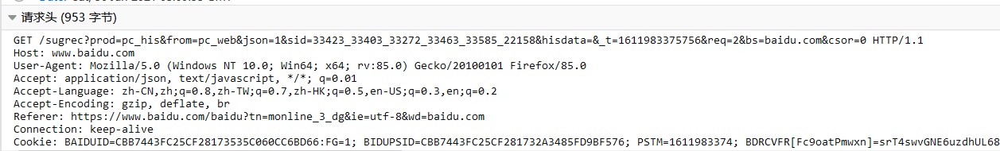
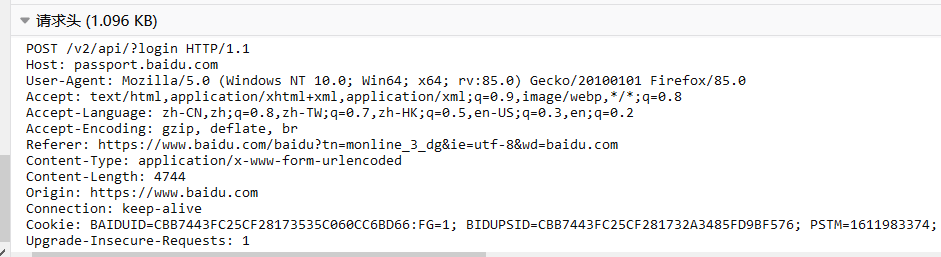

# 关于HTTP

HTTP协议是以 ASCII 码传输的，建立在 TCP/IP 协议之上的应用层规范。规范把 HTTP 请求分为三个部分：

- 状态行
- 请求头
- 请求行

```
<method> <request-URL> <version>
<headers>

<entity-body>
```

HTTP定义了与服务器交互的不同方法，最基本的方法有四种：

- GET
- POST
- PUT
- DELETE

URL（Uniform Resource Locator），统一资源定位符，它用于描述网络上的一个资源，而 HTTP 中的四种请求就对应着这个资源的增删改查。

# GET

用于信息获取，而且是安全的，等幂的

- 安全的：用于获取信息而非修改信息，不产生副作用，不影响资源的状态。
- 幂等的：对同一个 URL 的多个请求应该返回同样的结果

GET 请求报文示例：

```
 GET /books/?sex=man&name=Professional HTTP/1.1
 Host: www.example.com
 User-Agent: Mozilla/5.0 (Windows; U; Windows NT 5.1; en-US; rv:1.7.6)
 Gecko/20050225 Firefox/1.0.1
 Connection: Keep-Alive
```



# POST

表示可能修改变服务器上的资源的请求。

```
 POST / HTTP/1.1
 Host: www.example.com
 User-Agent: Mozilla/5.0 (Windows; U; Windows NT 5.1; en-US; rv:1.7.6)
 Gecko/20050225 Firefox/1.0.1
 Content-Type: application/x-www-form-urlencoded
 Content-Length: 40
 Connection: Keep-Alive

 sex=man&name=Professional  
```




# 区别

1. GET 不会影响资源，POST 有可能会影响资源
2. GET 提交的数据显示在 URL 中，可提交的数量受 URL 长度的限制，POST 提交的数量在 HTTP 消息主体中，没有长度限制。
3. GET 效率高，安全性低；POST效率低，安全性高