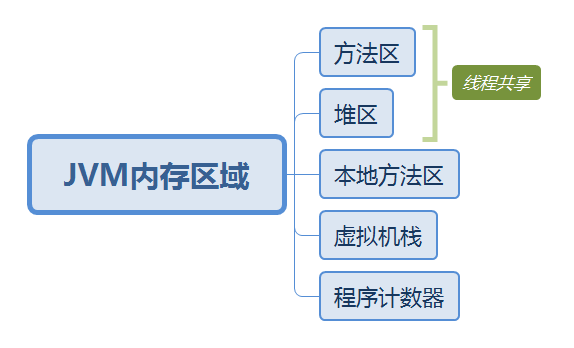
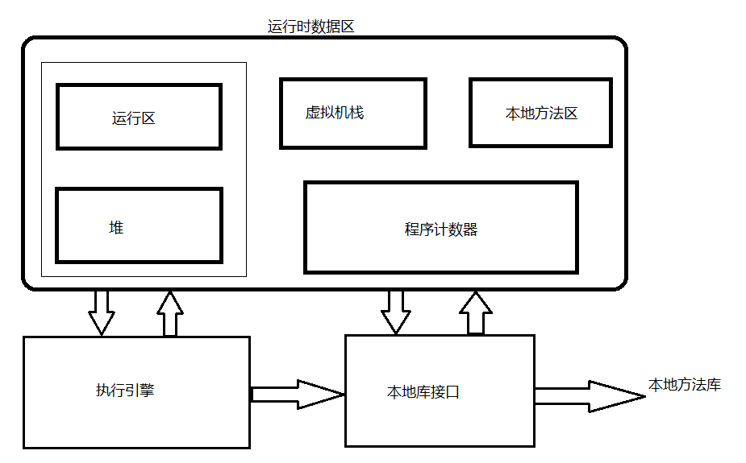
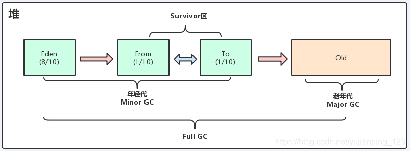
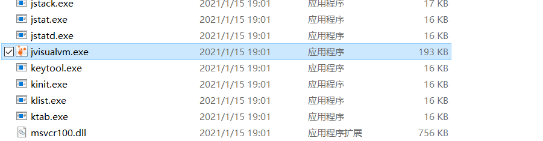
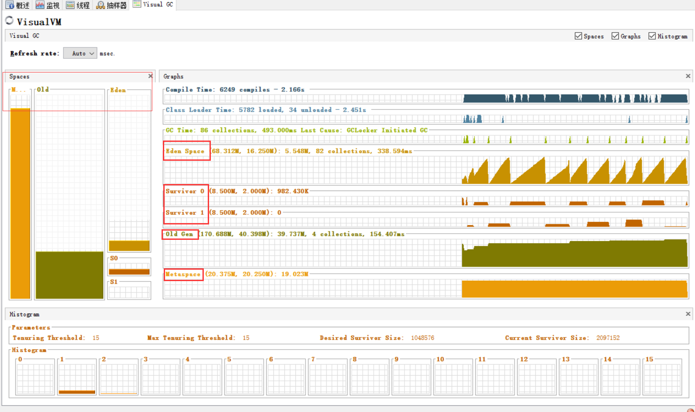

<!-- TOC -->

- [JVM 内存管理与垃圾回收](#jvm-内存管理与垃圾回收)
    - [内存管理](#内存管理)
        - [方法区（Method Area）](#方法区method-area)
        - [堆区（Heap）](#堆区heap)
        - [本地方法区（Native Method Stack）](#本地方法区native-method-stack)
        - [虚拟机栈（VM Stack）](#虚拟机栈vm-stack)
                - [局部变量表](#局部变量表)
        - [程序计数器（Program Counter Register）](#程序计数器program-counter-register)
    - [垃圾回收](#垃圾回收)
        - [为什么分代回收？](#为什么分代回收)
        - [GC 过程](#gc-过程)
            - [年轻代](#年轻代)
            - [老年代](#老年代)
            - [永久代（元空间）](#永久代元空间)
    - [分析工具](#分析工具)
    - [参考资料](#参考资料)

<!-- /TOC -->

# JVM 内存管理与垃圾回收

Java应用程序是运行在 JVM 上的，得益于 JVM 的内存管理和垃圾收集机制，开发人员的效率得到了显著提升，也不容易出现内存溢出和泄漏问题。但正是因为开发人员把内存的控制权交给了JVM，一旦出现内存方面的问题，将很难排查错误，因此了解 JVM 的内存管理与垃圾回收机制是有必要的。

## 内存管理

### 方法区（Method Area）

存储类信息、常量池、静态变量、JIT编译后的代码等数据。运行时常量池是方法区的一部分，Class文件常量池将在类加载后进入方法区的运行时常量池中存放。一个类加载到 JVM 中后对应一个运行时常量池。

### 堆区（Heap）

主要内存区域（也是最大的一块），用来存储对象实例及数组值。

### 本地方法区（Native Method Stack）

用于支持 native 方法的执行，存储每个 native 方法调用的状态。

### 虚拟机栈（VM Stack）

线程私有，每个线程对应一个虚拟机栈。一个线程的每个方法在执行的同时，都会创建一个栈帧（Stack Frame），栈帧中存储的有**局部变量表、操作栈、动态链接、方法出口**等，当方法被调用时，栈帧在 JVM 栈中入栈，当方法执行完成时，栈帧出栈。

##### 局部变量表

存储着方法的相关局部变量，包括各种**基本数据类型**，**对象的引用**，**返回地址**等。

### 程序计数器（Program Counter Register）

是一个比较小的内存区域，可能是CPU寄存器或者操作系统内存，主要用于指示当前线程所执行的字节码执行到了第几行。

字节码解释器在工作时，会通过改变这个计时器的值取下一条语句指令，每个程序计数器只用来记录一个线程的行号，所以是线程私有的。

由于程序计数器只用来记录当前指令地址，所以不存在内存溢出的情况，因此，程序计数器是 JVM 内存区域中唯一一个没有定义 OutOfMemoryError 的区域。

## 垃圾回收

### 为什么分代回收？

不同对象的生命周期是不一样的，因此采用不同的回收方式，可以提高回收效率。

### GC 过程

JVM 的堆内存可以分为年轻代和老年代，年轻代又分为 Eden 区和 Survivor 区

#### 年轻代

新创建的对象会被分配到 Eden 区（如果占用内存非常大，则直接分配到老年代区），当 Eden 区内存不够的时候就会触发 **Minor GC**。
在 Minor GC 开始的时候，对象只会存在于 Eden 区和 Survivor From 区，Survivor To 区是空的。
Minor GC 操作后，Eden 区如果仍然存活（判断标准是被引用了，GC root 可达性判断）的对象，将会被移到 Survivor To 区，对象在 Survivor 区每熬过一次 Minor GC，年龄就会 +1 岁，当年龄达到一定值的对象会被移动到老年代中，否则对象会被复制到 Survivor To 区，Eden 区和 From区已经被清空。

From 区和 To 区互换角色，GC 后保证 To 区是空的。（因为复制算法，所以有 From 和 To 两块区域）

#### 老年代

随着 Minor GC 的持续进行，老年代中对象也会持续增长，导致老年代的空间也会不够用，最终会执行 **Major GC**（比 Minor GC 慢很多），Major GC 使用的算法是标记清除算法或者标记压缩算法。

**标记清除算法**

1. 从 GC root 进行遍历，对可达对象标记
2. 从 GC root 二次遍历，将没有打上标记的对象清除掉

| 优点                                                         | 缺点                                                     |
| ------------------------------------------------------------ | -------------------------------------------------------- |
| 老年代对象一般是比较稳定的，相比复制算法，不需要复制大量对象 | 这种方式需要中断其它线程，相比复制算法，可能产生内存碎片 |

**标记压缩算法**

与标记清除基本相同，不同的是，在清除完成之后，会把存活的对象向内存的一边进行压缩，这样就可以解决内存碎片问题。

当老年代也装不下的时候，就会抛出OOM (Out Of Memory) 异常

#### 永久代（元空间）

JVM 加载类的时候，需要记录类的元数据，这些数据会保存在一个单独的内存区域内，在 Java 7 里，这个空间被称为永久代（Permgen），在 Java 8 里，使用元空间（Metaspace）代替了永久代。永久代和元空间保存的数据并不完全一样，永久代中还保存另一些与类的元数据无关的杂项。

元空间在本地内存中，而原来的永久代在 JVM 中，这样就解决了永久代的 OOM 问题，也降低了老年代 GC 复杂度。

## 分析工具

使用 jvisualvm 工具（在 Java 安装目录的 bin 目录下）分析 jvm 内存（需要添加Visual GC插件）

## 参考资料

- [jvm之年轻代（新生代）、老年代、永久代以及GC原理详解](https://blog.csdn.net/yujianping_123/article/details/99545138)
- [JVM内存管理及GC机制](https://blog.csdn.net/suifeng3051/article/details/48292193)
