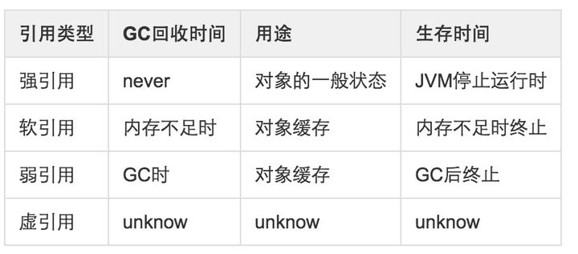
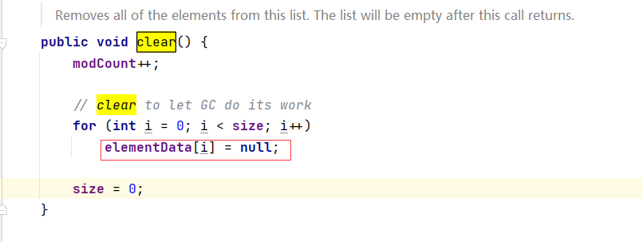

# Java 的四种引用总结




# 强引用

最普遍的引用

```
Object o = new Object();
```

特点：不会被GC
将对象的引用显式地设置为null，可以帮助垃圾收集器回收此对象
ArrayList的实现源代码



# 软引用

描述一些有用但是并非必须的对象，使用 java.lang.ref.SoftReference 类来表示。

特点：只有内存不足的时候 JVM 才会回收该对象。比较适合用来实现缓存。
软引用可以和一个引用队列（ReferenceQueue）联合使用，如果软引用所引用的对象被垃圾回收器回收，Java虚拟机就会把这个软引用加入到与之关联的引用队列中。


# 弱引用

不管当前内存空间是否足够，只具有弱引用的对象一旦被垃圾收集器扫描到就会被回收。

# 虚引用

也称为幻影引用：不会对对象的生存时间构成影响，也无法通过虚引用来获取对一个对象的真实引用。
唯一的用处是，当对象被 GC 时收到系统通知。

使用 PhantomReference 来实现虚引用。