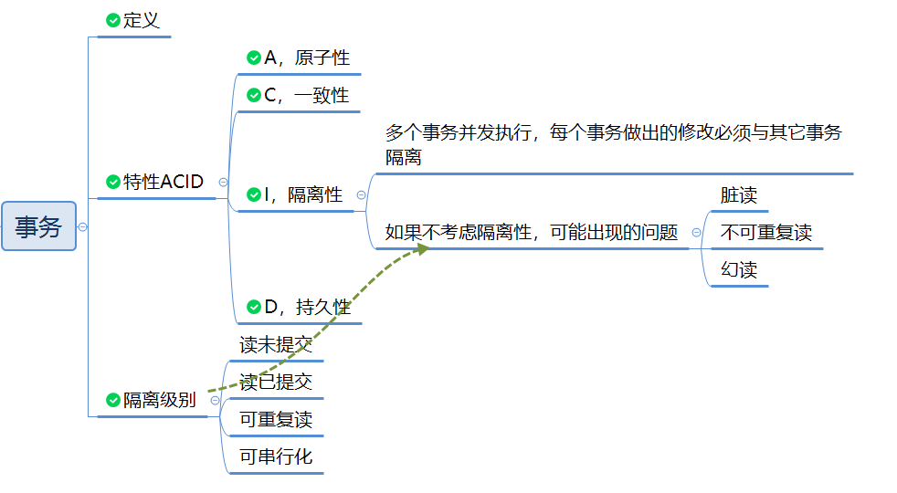

# 什么是事务

 把多条 SQL 语句作为一个整体进行具体操作的功能，被称为**数据库事务**。
 数据库事务可以确保该事务范围内的所有操作，要么全部成功要么全部失败。 

# 事务的特性

-  A: Atomic，原子性，将所有 SQL 作为原子工作，要么全部执行，要么全部不执行；
- C：Consistent，一致性，事务完成后，所有数据的状态都是一致的，系统从一个正确的状态，迁移到另一个正确的状态（即满足预定的约束）；
- I：Isolation，隔离性，多个事务并发执行，每个事务做出的修改必须与其它事务隔离；
- D：Duration，持久性，事务完成后，对数据库数据的修改被持久化存储，不会被回滚。

# 事务的隔离级别 

 如果不考虑事务的隔离性，可能会出现的问题： 

| 问题       | 含义                                                         |
| ---------- | ------------------------------------------------------------ |
| 脏读       | 在一个事务处理过程里读取了另一个**未提交事务**中的数据       |
| 不可重复读 | 对于数据库中的**某个数据**，一个事务范围内多次查询该数据却返回不同的数据值（查询期间另一个事务进行了**修改并提交**了） |
| 幻读       | 一个事务在根据某些条件查询出一些记录，之后另一个事务又向表中插入了这些条件的记录，原先的事务再次再次按照该条件查询时，能把另一个事务插入的记录也读出来，好像出现幻觉一样。 与不可重复读的区别，幻读针对的是一批数据整体，而不可重复读针对的是同一个数据项 |

MySQL提供的四种隔离级别：

| 隔离级别 | 含义                                                         | 可能出现的问题         |
| -------- | ------------------------------------------------------------ | ---------------------- |
| 读未提交 | 事务A可以读取到事务B修改过但未提交的数据                     | 脏读、不可重复读、幻读 |
| 读已提交 | 事务B只能在事务A修改过并且已提交后才能读取到事务B修改过的数据 | 不可重复读、幻读       |
| 可重复读 | 事务B只能在事务A修改过数据并提交后，**自己也提交后**，才能读取到事务B修改的数据 | 幻读                   |
| 可串行化 | 在该隔离级别下事务都是串行顺序执行的，MySQL数据库的InnoDB引擎会给读操作隐式加一把读共享锁 | 不会出现任何问题       |

# 参考链接

https://www.liaoxuefeng.com/wiki/1177760294764384/1179611198786848

https://www.zhihu.com/question/31346392

https://www.cnblogs.com/fjdingsd/p/5273008.html

（推荐）https://developer.aliyun.com/article/743691

（推荐）https://developer.ibm.com/zh/technologies/databases/articles/os-mysql-transaction-isolation-levels-and-loc
