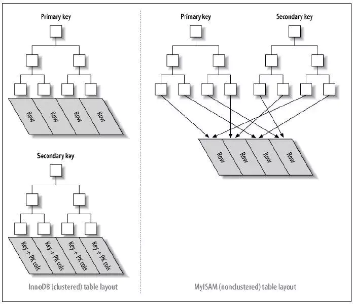

# 最左前缀匹配原则

> 是什么？
>
> 为什么？
>
> 怎么做？

## 一、概念

新建一个**联合索引**，联合索引的所有前缀都会用于查询，联合索引(col1, col2, col3)的所有前缀(col1)、(col1, col2)、(col1, col2, col3)，包含这些列的查询都会启用索引查询。

## 二、原因

为什么有该原则呢？

索引的底层是一颗B+树，那么联合索引的底层也就是一颗B+树，只不过联合索引的B+树节点中存储的是键值。由于构建一棵B+树只能根据一个值来确定索引关系，所以数据库依赖联合索引最左的字段来构建。 

最左前缀匹配原则应用于**联合索引**，那么我们就先分析联合索引的原理。

### 1. 联合索引

在多个列上建立索引，就是联合索引，也称为组合索引。

> 索引是为了加速查找的，底层用于实现的数据结构是B+树。
>
> 索引的类型有两种，一种是聚集索引，另一种是非聚集索引。
>
> 聚集索引的叶节点上存放着一整行的记录，一张表只允许一个聚集索引，一般为主键索引；
>
> 非聚集索引的叶节点上存放着主键值，也称为二级索引。
>
>   


在建表的时候，MySQL会默认为主键建立**主键索引**（为主键建立的索引为聚集索引）。

比如有一张表(id, name, age)，id为主键，那么建表之后，在 id 列上就存在一个聚集索引。

如果我们进行一个查询

```sql
select name from table_name where id=1;
```

那么该查询就会使用主键索引，在主键索引树上扫描id=1的那个节点，然后把记录返回。

倘若我们在 name 列上建立了一个二级索引 name_index，并且做了以下查询

```sql
select * from table_name where name='zhangsan';
```

条件里面只有一个 name 字段，所以会使用 name_index，又因为记录都在主键索引树的叶节点上，所以这个查询会扫描两次索引树。

- 首先使用二级索引name_index，扫描索引树，找到该记录所在的主键索引。
- 利用上一步找到的主键索引值，在主键索引树进行扫描，找到该记录值

第二个步骤称为**回表**。

回表这种情况的出现，会导致我们的查询多进行一次扫描，如果我们可以减少一次扫描，就会让查询变得更快，而联合索引就是为了解决这个问题的。

如果存在一个联合索引(name, age)，那么在进行查询

```sql
select age from table_name where name='zhangsan';
```

这时候，该查询可以直接通过联合索引得到age，就不需要进行回表操作。

## 2. 怎么建索引

索引的底层是一棵 B+ 树，只不过联合索引的键值数量不是一个，而是多个。
构建一棵B+树只能根据一个值来构建，因此**数据库依据索引最左的字段来构建B+树**。 

 举例：创建一个（a,b）的联合索引，那么它的索引树就是下图的样子。 

  

可以看到a的值是有顺序的，1，1，2，2，3，3，而b的值是没有顺序的1，2，1，4，1，2。但是我们又可发现**a在等值的情况下，b值又是按顺序排列的，但是这种顺序是相对的。这是因为MySQL创建联合索引的规则是首先会对联合索引的最左边第一个字段排序，在第一个字段的排序基础上，然后在对第二个字段进行排序。所以b=2这种查询条件没有办法利用索引**。

 

